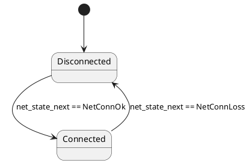

# Pico isolated analogue measurement
The integration test are evaluated in a manual manner.

## State machine

```plantuml
@startuml
[*] --> Disconnected
Disconnected --> Connected : net_state_next == NetConnOk
Connected --> Disconnected : net_state_next == NetConnLoss
@enduml
```